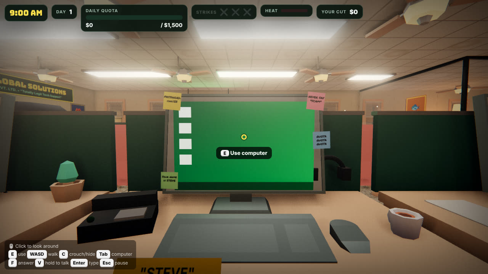
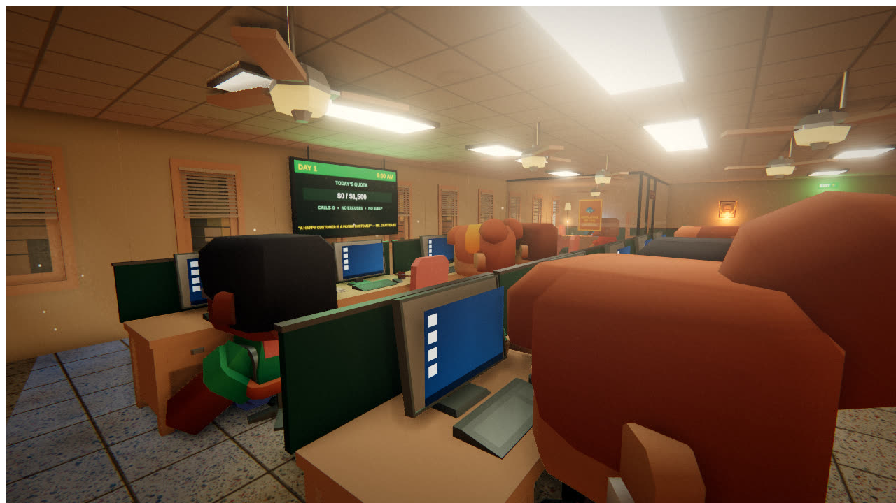
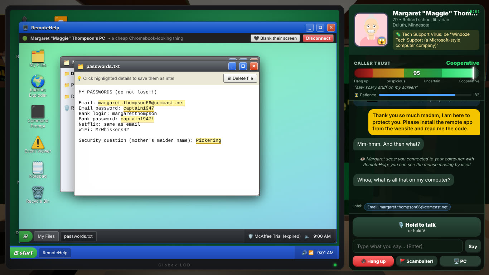
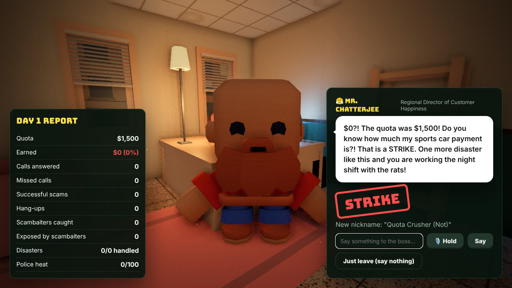

# 💸 Scam Call Center — Kolkata Night Shift

A single-player comedy call-center sim inspired by *Scam With Your Friends*. You work the
phones at a very shady "tech support" company in Kolkata, con **AI-driven callers** out of
their (fictional) life savings, survive office disasters, and face a performance review from
your rage-filled boss, Mr. Chatterjee. Multiplayer co-op is marked *coming soon*.

Built with **Vite + three.js**, voiced and powered by **Groq**. Runs on `localhost`.

> All callers, companies and money in the game are fictional. It's a parody.

| | |
| --- | --- |
|  |  |
|  |  |

## Quick start

Requires **Node.js 18+**.

```bash
npm install
npm run dev
```

Your browser opens **http://localhost:5173**. Then:

1. **Settings → 🤖 AI & API key** → paste your Groq key (get one at <https://console.groq.com/keys>) → **Test key**.
2. Main menu → **Start shift**.

No key? The game still runs in *offline mode* (a simple keyword-based caller brain + your
browser's built-in voices), so you can try everything out first.

## AI models (Groq)

| What | Default model | Cost |
| --- | --- | --- |
| Callers, boss, coworkers | `openai/gpt-oss-20b` | $0.075 in / $0.30 out per 1M tokens — the cheapest model on Groq's pay-as-you-go plan |
| Caller & boss voices (TTS) | `canopylabs/orpheus-v1-english` | $22 per 1M characters (Groq's text-to-speech) |
| Your voice (STT) | `whisper-large-v3` | $0.111 per audio hour — Groq's most accurate Whisper |

You can change any of them in Settings (e.g. `openai/gpt-oss-120b` for smarter callers,
`whisper-large-v3-turbo` for cheaper transcription). The key is stored only in your browser's
localStorage and only sent to `api.groq.com`.

*If voices fail with a "terms" error, open the Groq console playground, pick the Orpheus model
once and accept its terms.*

## How to play

| Key | Action |
| --- | --- |
| **F** | Answer the ringing phone |
| **V** (hold) | Push-to-talk — speak to the caller (rebindable) |
| **Enter** | Type instead of talking |
| **Tab** / **E** on monitor | Use your computer |
| **WASD**, mouse | Get up and walk around the office |
| **E** / click | Interact (breakers, router, shredder, extinguisher, cows…) |
| **C** | Crouch — hide under your desk during raids and air strikes |
| **Esc** | Leave the computer / pause |

**The loop:** calls arrive → pick a scam that fits the lead (virus pop-up, refund email,
tax warrant, bank fraud text, customs package, sweepstakes, crypto bot, router hackers…) →
talk your way up the **Trust Meter** → get them to install **RemoteHelp** and read you their
ID → snoop their PC for personal details (click highlighted facts to save them as intel; using
them on the phone builds trust) → get paid in gift cards / wires / crypto → redeem it in the
**Cashier** → hit the daily quota before 5 PM → survive the boss's review → spend your cut in
the company store → next, harder day. Three strikes and you're fired.

**The Trust Meter** is decided each turn by the AI, based on what you actually said, the
caller's personality, mood, memory of the conversation, what you do on their screen and what
they hear in your office, then scaled by their gullibility/skepticism in code. Callers won't
install remote software below 35 trust or pay below 55, and they hang up when trust or
patience runs out.

**Scambaiters** pretend to be perfect victims. Tells: VirtualBox / OBS on their PC, files about
scammers, suspicious eagerness, gift-card codes that come back invalid, `.exe` "documents".
Flag them (🚩) for a bounty — or get exposed on their stream.

**Your PC** ("Windoze XD"): Phone, RemoteHelp, Notes + intel, Browser (people finder,
gift-card checker, news, intranet), Cashier, Playbook, Messenger (AI coworkers), Files,
DefendoMax antivirus, Screen Recorder (real clips of your calls), Paint, Camera (with
disguise filters), DocForge (fake warrants and certificates), and SiteForge (fake websites). Anything
you show the caller is described to the AI and they react to it.

**On the victim's PC:** files, photos, email, online banking with a working
**Inspect Element** (the classic refund scam), Command Prompt (`tree`, `netstat`…), Event
Viewer, Notepad messages, and a "blank their screen" button.

**Office chaos:** power failures (flip the breakers), broken headsets, the boss patrolling,
viruses on your own PC, internet outages, a cow, police raids (shred + hide), fires
(extinguisher), air-raid sirens, the chai wallah, cricket matches, monsoon floods…
Callers can hear all of it.

## Graphics

Settings → 🖼️ Graphics has **Low / Medium / High / Ultra** presets. High (default) includes:
ACES tone mapping, a golden-hour sun with shadow-mapped window blinds, soft rect-area ceiling
lights, a **baked reflection + irradiance probe** captured from the office itself (bounce light
and glossy reflections), ground-truth ambient occlusion (GTAO), bloom, raymarched
**volumetric sun shafts** with dust motes, planar reflections on the polished terrazzo floor,
and a film grade (vignette, grain, subtle chromatic aberration). Drop to Medium/Low on laptops.

## Modding

* JSON caller personalities, scams and events live in [`public/mods/`](public/mods/README.md)
  and load through `public/mods/manifest.json`.
* Custom voices: WAV files in `public/mods/voices/` (see the modding guide).
* In-game **Custom Clients** maker: name, looks (avatar builder *or* your own picture for each
  emotion, uploaded or taken with your webcam), voice (Groq voice, your own WAV, or a
  recording), emotion sound effects, personality, dialogue style, trust behavior, reactions,
  scambaiter mode. Test-call them instantly; export/import as JSON.
* In-game **Mods** screen: import mod packs, toggle/remove them, download templates.

## Project layout

```
src/
  ai/        groq.js (API), callerBrain.js (caller AI + trust rules + offline brain),
             bossBrain.js, coworkers.js, speech.js (TTS/STT, push-to-talk, WAV babble voices)
  game/      game.js (day loop), callManager.js, chaos.js (disasters), content.js (mods),
             profile.js + victimPC.js (generated caller details/PCs), progression.js, run.js
  world/     world.js, office.js (layout), lighting.js (lights + probe bake), render.js
             (post-processing), materials.js, player.js, npc.js, fx.js, textures.js, assets.js
  ui/        hud, callPanel, computer + os/ (window manager and all apps), screens, review,
             shop, settings, clientMaker, mods, portraits
public/
  models/    Kenney CC0 GLB models (furniture, characters, vehicles, animals, food)
  mods/      manifest + callers/ scenarios/ events/ voices/
```

## Credits & licenses

* **3D models:** [Kenney](https://kenney.nl) — Furniture Kit, Mini Characters, Car Kit, Cube Pets, Food Kit (CC0).
* **Portraits:** Avataaars by Pablo Stanley via [DiceBear](https://dicebear.com) (free for personal & commercial use).
* **Fonts:** Bungee, Inter, VT323, Permanent Marker (SIL OFL) via Fontsource.
* **Engine:** three.js (MIT), Vite (MIT). Sound effects are synthesized at runtime.

No art, audio or text from *Scam With Your Friends* is included; everything here is original
or openly licensed.
